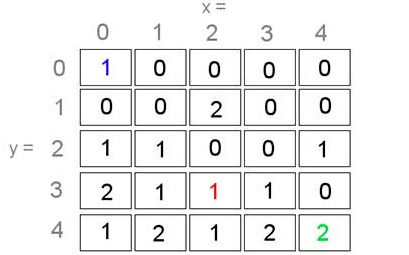
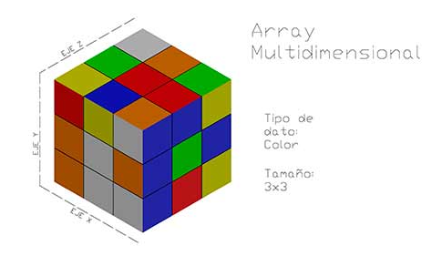
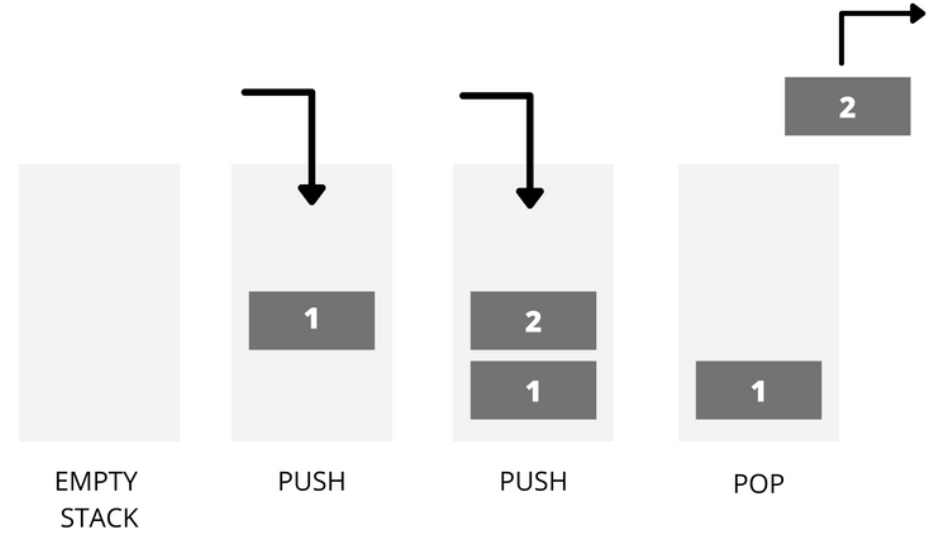
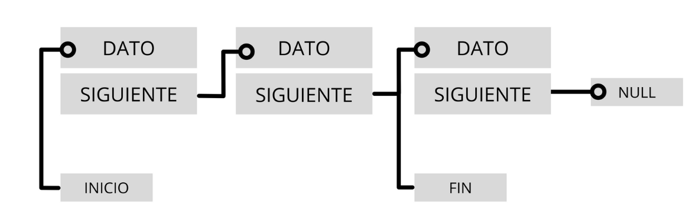
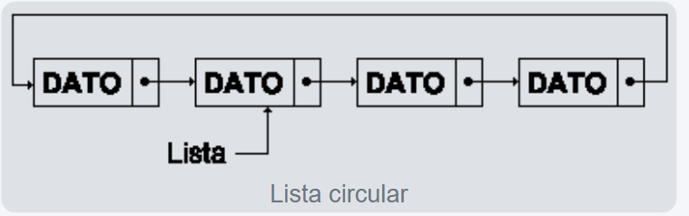
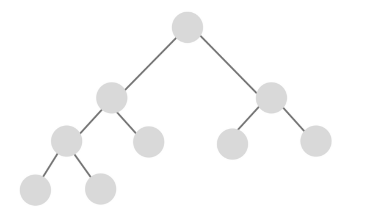
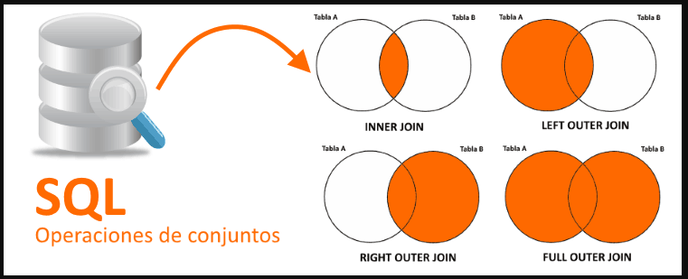
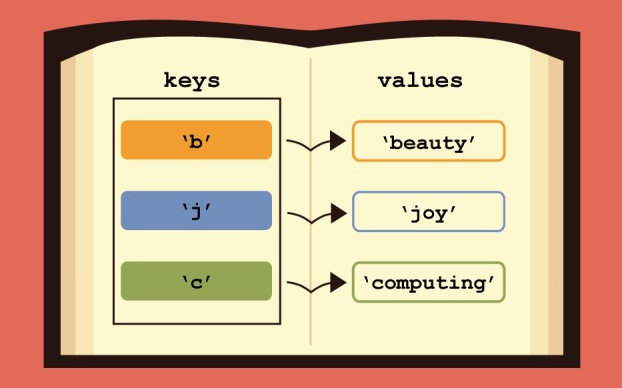

# Estructuras de datos
Por: Jesus Alberto Rodriguez Torres 24100668
## ¿Qué son?
Las estructuras de datos en programación son formas de representar y organizar la información en una computadora, siguiendo reglas internas que determinan su comportamiento y cómo se accede o modifica la información.

## Importancia
Son fundamentales para programar eficientemente, ya que permiten manejar datos de manera ordenada, optimizar el rendimiento del código y resolver problemas complejos. Conocer estructuras como listas, árboles o grafos ayuda a diseñar soluciones más efectivas y a prepararse para desafíos o entrevistas laborales.

## Tipos de estructuras de datos
Existen dos tipos principales: **estáticas** y **dinámicas**.

## Estructuras estáticas
Tienen un tamaño fijo definido antes de ejecutar el programa. No pueden cambiar su tamaño durante la ejecución. La elección depende del tipo de aplicación.

### Array
Es un tipo de dato estructurado que permite almacenar un conjunto de elementos **homogéneos y ordenados**. 

  **Casos de uso:**
    
- Almacenar datos de tamaño fijo.
- Acceso rápido a elementos mediante índices.

#### Arrays unidimensionales
Un array unidimensional (vector) es aquel en el cual se puede acceder a cualquier elemento solamente con un índice.

Se puede imaginar como si se tratase de una lista de datos en la cual, para referirnos a cada elemento de dicha lista, emplearemos un número (índice) para indicar la posición en la que podemos encontrar dicho elemento dentro de ella.


#### Arrays bidimensionales
En el caso de los arrays bidimensionales (También llamados tablas o matríces), son 2 los índices necesarios para localizar cualquier elemento.

Cualquier elemento dentro del array bidimensional se puede imaginar como un elemento que se encuentra localizado dentro de una posición determinadas en un “eje X” y un “eje Y”. 




#### Arrays multidimensionales
También se pueden crear arrays de más de 2 dimensiones y son los denominados arrays multidimensionales.

En este caso el número de índices viene determinado por el número de dimensiones de nuestro array, por ejemplo, para un array tridimensional el número de índices sería 3.

Igual que ocurre con los otros tipos de arrays, cualquier elemento puede ser localizado mediante una posición concreta.





## Estructuras dinámicas
Son colecciones de elementos llamados **nodos**, que pueden crecer o reducirse durante la ejecución del programa. Son más flexibles que los arrays para gestionar información variable.

### Lineales
Se caracterizan porque sus elementos se organizan de forma sucesiva, cada uno con un único sucesor y un único predecesor. Las más comunes son:

#### **Pila (Stack)**  
  Estructura LIFO (*Last In, First Out*), donde el último elemento en entrar es el primero en salir. Operaciones principales:

  - `Push`: añade un elemento.
  - `Pop`: retira el último elemento añadido.





```csharp
// Ejemplo de Pila en C#
using System;
using System.Collections.Generic;

class EjemploPila
{
    static void Main()
    {
        Stack<int> pila = new Stack<int>();
        pila.Push(10);
        pila.Push(20);
        Console.WriteLine("Elemento en la cima: " + pila.Peek());
        Console.WriteLine("Elemento retirado: " + pila.Pop());
    }
}
```

**Casos de uso:**

   - Deshacer operaciones en editores de texto.
   - Evaluación de expresiones matemáticas.
   - Manejo de llamadas a funciones en lenguajes de programación.

#### **Cola (Queue)**  
  Estructura FIFO (*First In, First Out*), donde el primer elemento en entrar es el primero en salir. Operaciones principales:

  - `Enqueue`: añade un elemento al final.
  - `Dequeue`: elimina el primer elemento.


```csharp
// Ejemplo de Cola en C#
using System;
using System.Collections.Generic;

class EjemploCola
{
    static void Main()
    {
        Queue<string> cola = new Queue<string>();
        cola.Enqueue("Ana");
        cola.Enqueue("Luis");
        Console.WriteLine("Primer elemento de la cola: " + cola.Peek());
        Console.WriteLine("Elemento retirado: " + cola.Dequeue());
    }
}
```

**Casos de uso:**

- Sistemas de impresión.
- Manejo de tareas en procesos concurrentes.
- Simulación de procesos en sistemas operativos.

#### **Lista enlazada**  
  Formada por nodos conectados en secuencia mediante referencias. Permite insertar o eliminar elementos en cualquier posición de manera eficiente.

  **Casos de uso:**

- Implementar pilas y colas.
- Manejo dinámico de memoria.
- Construcción de estructuras de datos más complejas como árboles y grafos.


  - **Simple:** cada nodo apunta al siguiente.

    Los elementos, llamados nodos, están conectados de forma secuencial, donde cada nodo apunta al siguiente y el último no apunta a ninguno, indicando así el final de la lista.

    El primer nodo se conoce como cabeza de la lista, y a través de él se puede acceder a todos los demás elementos. Cuando este puntero no apunta a ningún nodo, se considera que la lista está vacía.

    Este tipo de estructura permite almacenar datos de forma flexible y dinámica, adaptándose al crecimiento o reducción del número de elementos durante la ejecución del programa.   
    Además, es fundamental conservar siempre la referencia al primer nodo, ya que si se pierde, será imposible acceder a los datos o liberar la memoria utilizada por la lista.

  


  - **Doble:** cada nodo apunta al siguiente y al anterior.

    En esta, cada nodo está conectado con el siguiente y con el anterior, permitiendo recorrer la lista en ambos sentidos.  
    
    A diferencia de las listas simples, no necesita un nodo especial para acceder a ella, ya que desde cualquier nodo se puede llegar a cualquier otro recorriendo los enlaces hacia adelante o hacia atrás.  

    Este tipo de lista facilita las operaciones de búsqueda, inserción y eliminación, haciéndolas más flexibles y eficientes en comparación con las listas simplemente enlazadas.

  


  - **Circular:** el último nodo apunta al primero, formando un ciclo.  

    Gracias a esto, todos los nodos están conectados entre sí, y las operaciones de inserción o eliminación se realizan de manera uniforme, sin tener que tratar de forma diferente el primer o el último nodo.

    En algunos casos se incluye un nodo de cabecera especial para evitar la única excepción posible: que la lista esté vacía.
    Aunque este tipo de lista facilita la inserción y eliminación de elementos, también complica las búsquedas, ya que no es sencillo determinar cuándo se ha recorrido toda la lista sin encontrar el elemento deseado.
  



## Tabla resumida de tipos de datos y estructuras

| Tipo de estructura | Ejemplos | Características principales | Operaciones comunes |
|-------------------|--------|------------------------|--------|
| Estática          | Array    | Tamaño fijo, elementos homogéneos y ordenados | Acceso por índice |
| Dinámica Lineal    | Pila (Stack) | LIFO, elementos sucesivos | Push, Pop, Peek |
| Dinámica Lineal    | Cola (Queue) | FIFO, elementos sucesivos | Enqueue, Dequeue, Peek |
| Dinámica Lineal    | Lista enlazada | Elementos conectados, flexible | Insertar, Eliminar, Recorrer |

## No lineales
También llamadas **multienlazadas**, permiten que cada elemento tenga varios sucesores o predecesores. Se dividen principalmente en:

- **Árboles:** estructura jerárquica donde cada nodo tiene un único antecesor y varios sucesores. Tipos comunes:
  - Árbol general: cada nodo puede tener varios subárboles.
  - Árbol binario: cada nodo puede tener hasta dos hijos.

     

  **Casos de uso:**

  - Representación de estructuras de directorios.  
  - Bases de datos NoSQL como MongoDB.  
  - Implementación de algoritmos como los árboles de decisión.   

    

  

- **Grafos:** formado por **nodos (vértices)** y **aristas (arcos)** que conectan esos nodos, útil para modelar redes y relaciones complejas.
  

  **Casos de uso:**
  
  - Representación de redes sociales.
  - Algoritmos de búsqueda y navegación (Dijkstra, A*).
  - Modelado de sistemas de transporte y logística.


## Abstractos

Las estructuras de datos abstractas (o tipos abstractos de datos, TAD) no se centran en cómo se almacenan los datos físicamente, sino en qué operaciones pueden realizarse sobre ellos. Describen el comportamiento lógico de los datos y las reglas para manipularlos, sin importar la implementación interna.

### Conjunto (Set)

Un conjunto es una estructura que almacena elementos sin repetir, es decir, cada valor aparece solo una vez.
No tiene un orden específico, y lo más importante es la pertenencia: si un elemento está o no dentro del conjunto.

Operaciones comunes:

- Unión: combina los elementos de dos conjuntos sin duplicarlos.

- Intersección: obtiene los elementos que están en ambos conjuntos.

- Diferencia: conserva los elementos que están en un conjunto, pero no en el otro.

- Pertenencia: verifica si un elemento está dentro del conjunto.  

Los conjuntos son muy útiles cuando se trabaja con agrupaciones únicas de datos, como listas de usuarios registrados, etiquetas o colecciones sin duplicados.

  

**Casos de uso:**

- Eliminación de datos duplicados en listas o registros.

- Gestión de usuarios únicos en sistemas o plataformas.

- Filtrado y comparación de colecciones de datos.

### Diccionario (Map o Diccionario Asociativo)

Un diccionario almacena pares de clave y valor, donde cada clave es única y sirve para acceder rápidamente al valor asociado.
A diferencia de los conjuntos, aquí el orden y la relación entre los datos importan, ya que cada clave identifica a un valor específico.

Operaciones comunes:

- Insertar: añade un nuevo par clave–valor.

- Buscar: obtiene el valor asociado a una clave.

- Eliminar: quita un par clave–valor del diccionario.

- Actualizar: cambia el valor de una clave existente.

Los diccionarios se usan con frecuencia en aplicaciones que necesitan acceso rápido y directo a información mediante un identificador, como bases de datos, configuraciones o catálogos de productos.

  

  **Casos de uso:**
  - Implementación de cachés.
  - Gestión eficiente de bases de datos.
  - Indexación en motores de búsqueda.

## Conclusiones
En conclusion, las estructuras de datos obviamente son esenciales para organizar y manejar la información de manera eficiente. Conocerlas y saber cómo aplicarlas hace que los programas sean más rápidos, claros y fáciles de mantener. Practicarlas en diferentes escenarios, tanto lineales como no lineales, ayuda a entender mejor cómo funciona un programa internamente y mejora nuestras habilidades como programadores/desarrolladores.


## Referencias bibliográficas
- [¿Qué es una estructura de datos en programación y para qué se utiliza? ](https://blog.soyhenry.com/que-es-una-estructura-de-datos-en-programacion/)
- [Estructuras de datos que todo desarrollador debería conocer con ejemplos](https://profile.es/blog/estructuras-de-datos-que-todo-desarrollador-deberia-conocer-con-ejemplos/)
- [Estructura de datos: ¿Para qué sirve y qué tipos existen?](https://www.universitatcarlemany.com/actualidad/blog/estructura-datos/)
- [Estructuras de datos: Listas abiertas](https://conclase.net/c/edd/cap4)
- [Estructuras de datos:  Listas doblemente enlazadas](https://conclase.net/c/edd/cap5)
- [Estructuras de datos: Listas circulares](https://conclase.net/c/edd/cap1)

- [¿Qué son los arrays? Tipos de arrays en C, C++, Java, Javascript y PHP](https://www.inesem.es/revistadigital/informatica-y-tics/arrays)
