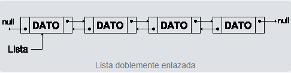

# Estructuras de datos

## ¿Qué son?
Las estructuras de datos en programación son formas de representar y organizar la información en una computadora, siguiendo reglas internas que determinan su comportamiento y cómo se accede o modifica la información.

## Importancia
Son fundamentales para programar eficientemente, ya que permiten manejar datos de manera ordenada, optimizar el rendimiento del código y resolver problemas complejos. Conocer estructuras como listas, árboles o grafos ayuda a diseñar soluciones más efectivas y a prepararse para desafíos o entrevistas laborales.

## Tipos de estructuras de datos
Existen dos tipos principales: **estáticas** y **dinámicas**.

## Estructuras estáticas
Tienen un tamaño fijo definido antes de ejecutar el programa. No pueden cambiar su tamaño durante la ejecución. La elección depende del tipo de aplicación.

### Array
Es un tipo de dato estructurado que permite almacenar un conjunto de elementos **homogéneos y ordenados**. Su posición permite acceder fácilmente a cada elemento, desde el primero hasta el último.


## Estructuras dinámicas
Son colecciones de elementos llamados **nodos**, que pueden crecer o reducirse durante la ejecución del programa. Son más flexibles que los arrays para gestionar información variable.

### Lineales
Se caracterizan porque sus elementos se organizan de forma sucesiva, cada uno con un único sucesor y un único predecesor. Las más comunes son:

#### **Pila (Stack)**  
  Estructura LIFO (*Last In, First Out*), donde el último elemento en entrar es el primero en salir. Operaciones principales:

  - `Push`: añade un elemento.
  - `Pop`: retira el último elemento añadido.

```csharp
// Ejemplo de Pila en C#
using System;
using System.Collections.Generic;

class EjemploPila
{
    static void Main()
    {
        Stack<int> pila = new Stack<int>();
        pila.Push(10);
        pila.Push(20);
        Console.WriteLine("Elemento en la cima: " + pila.Peek());
        Console.WriteLine("Elemento retirado: " + pila.Pop());
    }
}
```

#### **Cola (Queue)**  
  Estructura FIFO (*First In, First Out*), donde el primer elemento en entrar es el primero en salir. Operaciones principales:

  - `Enqueue`: añade un elemento al final.
  - `Dequeue`: elimina el primer elemento.

```csharp
// Ejemplo de Cola en C#
using System;
using System.Collections.Generic;

class EjemploCola
{
    static void Main()
    {
        Queue<string> cola = new Queue<string>();
        cola.Enqueue("Ana");
        cola.Enqueue("Luis");
        Console.WriteLine("Primer elemento de la cola: " + cola.Peek());
        Console.WriteLine("Elemento retirado: " + cola.Dequeue());
    }
}
```

#### **Lista enlazada**  
  Formada por nodos conectados en secuencia mediante referencias. Permite insertar o eliminar elementos en cualquier posición de manera eficiente.


  - **Simple:** cada nodo apunta al siguiente.

    Los elementos, llamados nodos, están conectados de forma secuencial, donde cada nodo apunta al siguiente y el último no apunta a ninguno, indicando así el final de la lista.

    El primer nodo se conoce como cabeza de la lista, y a través de él se puede acceder a todos los demás elementos. Cuando este puntero no apunta a ningún nodo, se considera que la lista está vacía.

    Este tipo de estructura permite almacenar datos de forma flexible y dinámica, adaptándose al crecimiento o reducción del número de elementos durante la ejecución del programa.   
    Además, es fundamental conservar siempre la referencia al primer nodo, ya que si se pierde, será imposible acceder a los datos o liberar la memoria utilizada por la lista.

  


  - **Doble:** cada nodo apunta al siguiente y al anterior.

    En esta, cada nodo está conectado con el siguiente y con el anterior, permitiendo recorrer la lista en ambos sentidos.  
    
    A diferencia de las listas simples, no necesita un nodo especial para acceder a ella, ya que desde cualquier nodo se puede llegar a cualquier otro recorriendo los enlaces hacia adelante o hacia atrás.  

    Este tipo de lista facilita las operaciones de búsqueda, inserción y eliminación, haciéndolas más flexibles y eficientes en comparación con las listas simplemente enlazadas.

  


  - **Circular:** el último nodo apunta al primero, formando un ciclo.  

    Gracias a esto, todos los nodos están conectados entre sí, y las operaciones de inserción o eliminación se realizan de manera uniforme, sin tener que tratar de forma diferente el primer o el último nodo.

    En algunos casos se incluye un nodo de cabecera especial para evitar la única excepción posible: que la lista esté vacía.
    Aunque este tipo de lista facilita la inserción y eliminación de elementos, también complica las búsquedas, ya que no es sencillo determinar cuándo se ha recorrido toda la lista sin encontrar el elemento deseado.
  


## Tabla resumida de tipos de datos y estructuras

| Tipo de estructura | Ejemplos | Características principales | Operaciones comunes |
|-------------------|--------|------------------------|--------|
| Estática          | Array    | Tamaño fijo, elementos homogéneos y ordenados | Acceso por índice |
| Dinámica Lineal    | Pila (Stack) | LIFO, elementos sucesivos | Push, Pop, Peek |
| Dinámica Lineal    | Cola (Queue) | FIFO, elementos sucesivos | Enqueue, Dequeue, Peek |
| Dinámica Lineal    | Lista enlazada | Elementos conectados, flexible | Insertar, Eliminar, Recorrer |

## No lineales
También llamadas **multienlazadas**, permiten que cada elemento tenga varios sucesores o predecesores. Se dividen principalmente en:

- **Árboles:** estructura jerárquica donde cada nodo tiene un único antecesor y varios sucesores. Tipos comunes:
  - Árbol general: cada nodo puede tener varios subárboles.
  - Árbol binario: cada nodo puede tener hasta dos hijos.

     

- **Grafos:** formado por **nodos (vértices)** y **aristas (arcos)** que conectan esos nodos, útil para modelar redes y relaciones complejas.
  


## Conclusiones
En conclusion, las estructuras de datos obviamente son esenciales para organizar y manejar la información de manera eficiente. Conocerlas y saber cómo aplicarlas hace que los programas sean más rápidos, claros y fáciles de mantener. Practicarlas en diferentes escenarios, tanto lineales como no lineales, ayuda a entender mejor cómo funciona un programa internamente y mejora nuestras habilidades como programadores/desarrolladores.


## Referencias bibliográficas
- [¿Qué es una estructura de datos en programación y para qué se utiliza? ](https://blog.soyhenry.com/que-es-una-estructura-de-datos-en-programacion/)
- [Estructuras de datos que todo desarrollador debería conocer con ejemplos](https://profile.es/blog/estructuras-de-datos-que-todo-desarrollador-deberia-conocer-con-ejemplos/)
- [Estructura de datos: ¿Para qué sirve y qué tipos existen?](https://www.universitatcarlemany.com/actualidad/blog/estructura-datos/)
- [Estructuras de datos: Listas abiertas](https://conclase.net/c/edd/cap4)
- [Estructuras de datos:  Listas doblemente enlazadas](https://conclase.net/c/edd/cap5)
- [Estructuras de datos: Listas circulares](https://conclase.net/c/edd/cap1)

